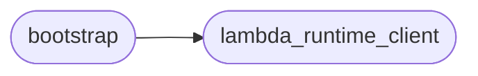

# Code Overview

[_Documentation generated by Documatic_](https://www.documatic.com)

<!---Documatic-section-Codebase Structure Python-start--->
## Codebase Structure Python

The codebase has a flat structure, with 2 code files.

<!---Documatic-block-system_architecture-start--->

<!---Documatic-block-system_architecture-end--->

# #
<!---Documatic-section-Codebase Structure Python-end--->

<!---Documatic-section-File IO-start--->
## File IO

<!---Documatic-block-file_io-start--->
The following files have file write operations

<!---Documatic-block-python37-start--->

	
<code>python37</code> (Click to Expand!)

* python37.bootstrap

<!---Documatic-block-python37-end--->
<!---Documatic-block-file_io-end--->

# #
<!---Documatic-section-File IO-end--->

<!---Documatic-section-Class Hierarchy-start--->
## Class Hierarchy

<!---Documatic-block-Exception-start--->

	
<code>Exception</code> (Click to Expand!)

* python37.bootstrap.JsonError
* python37.lambda_runtime_client.LambdaRuntimeClientError

<!---Documatic-block-Exception-end--->

<!---Documatic-block-logging.Filter-start--->

	
<code>logging.Filter</code> (Click to Expand!)

* python37.bootstrap.LambdaLoggerFilter

<!---Documatic-block-logging.Filter-end--->

<!---Documatic-block-logging.Handler-start--->

	
<code>logging.Handler</code> (Click to Expand!)

* python37.bootstrap.LambdaLoggerHandler

<!---Documatic-block-logging.Handler-end--->

<!---Documatic-block-object-start--->

	
<code>object</code> (Click to Expand!)

* python37.bootstrap.Client
* python37.bootstrap.ClientContext
* python37.bootstrap.LambdaContext
* python37.bootstrap.Unbuffered
* python37.lambda_runtime_client.InvocationRequest
* python37.lambda_runtime_client.LambdaRuntimeClient

<!---Documatic-block-object-end--->

# #
<!---Documatic-section-Class Hierarchy-end--->

[_Documentation generated by Documatic_](https://www.documatic.com)